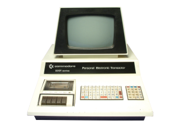

# rooms_2_0

## ROOMS 2.0 - Run &amp; Collect - Retro Game

**Idea:**

The idea was born 1981 during my computer lesson at school.
Moving a player automatically through roomes to collect things.
The player get a new randomized direction if he had contact with a wall.
Also his moving direction could be controlled by arrow keys.
Goal of the gam was to collect all things in all rooms.

**Implementation:** 

The rooms / walls were drawn by blockes of 8x8 pixles (one character block). 
The player was a block (checker pattern), the things to collect were asterixs.

**Original hardware:** 

I have implemented this game first on a personal computer (Commodore PET 2001)
with the integrated programming language BASIC and 32KB ram.
No floppy disc / hard disk was available. The source was saved on a music tape. 

More detailed information at [Wikipedia](https://de.wikipedia.org/wiki/PET_2001). 

